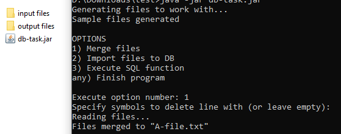
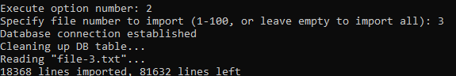
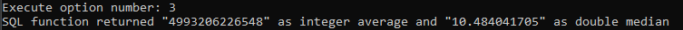
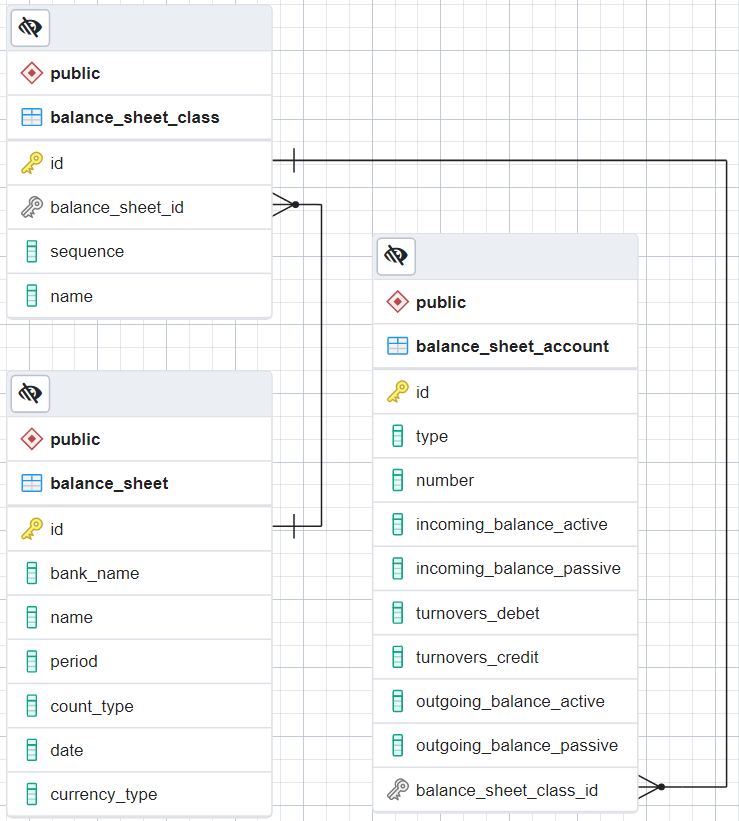
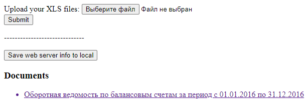
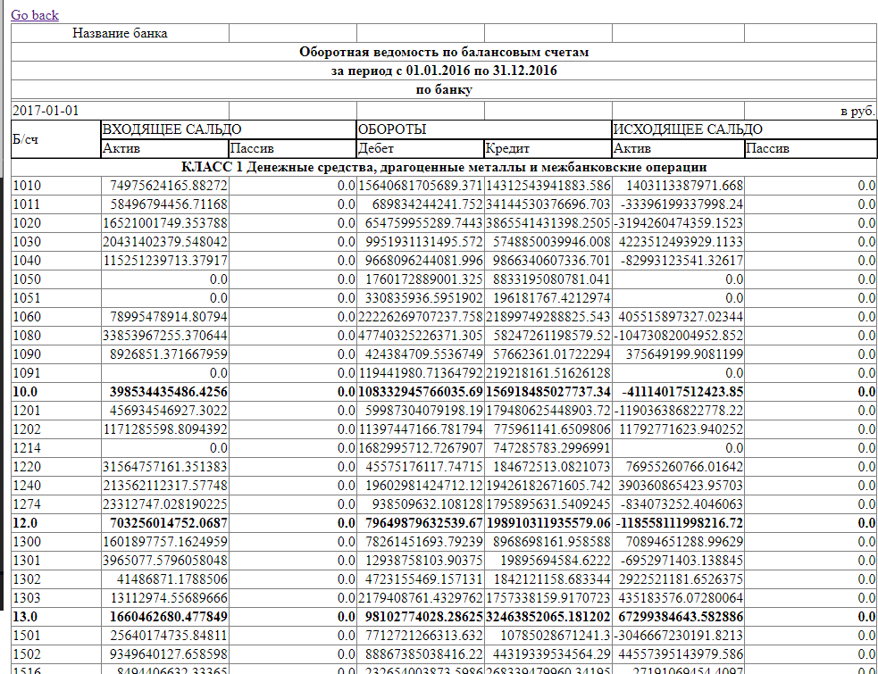
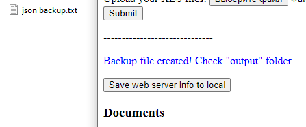

## Report for tasks

### Task 1

#### Description

Built with: **Maven**, Language: **Java 11**, Database: **PostgreSQL**

#### Conditions

1) Program generates files on startup. its 100 `.txt` files inside **input** folder.
2) Program merges all files from input folder to output folder with filename `A-file.txt`.  

3) Program gets selected file (or all if not specified) and commits it to database.  

4) Program calls function from database and returns its value.  
  
Sql for this function:  
    ```sql
    CREATE OR REPLACE FUNCTION public.integersumanddoublemed(
        )
        RETURNS record
        LANGUAGE 'plpgsql'
        COST 100
        VOLATILE PARALLEL UNSAFE
    AS $BODY$
    DECLARE
    rowsCount INTEGER;
    integerValue BIGINT; 
    doubleValue1 "file-entries";
    doubleValue2 "file-entries";
    doubleValue DOUBLE PRECISION; 
    recordValue RECORD;
    BEGIN
    
        -- Getting the count of rows
        SELECT COUNT(*) from "file-entries" INTO rowsCount;
        RAISE NOTICE 'Number of rows: %', rowsCount;
    
        -- Module = center if number of rows is odd
        IF MOD(rowsCount, 2) = 0 THEN 
    
             -- Getting first value for median
            SELECT * FROM (SELECT * from "file-entries" ORDER BY "double-number" LIMIT ((rowsCount / 2) + 1)) AS innerSelect ORDER BY "double-number" DESC LIMIT 1
            INTO doubleValue1;
            RAISE NOTICE 'First value: %', doubleValue1."double-number";
            
            -- Getting second value for median
            SELECT * FROM (SELECT * from "file-entries" ORDER BY "double-number" LIMIT (rowsCount / 2)) AS innerSelect ORDER BY "double-number" DESC LIMIT 1
            INTO doubleValue2;
            RAISE NOTICE 'Second value: %', doubleValue2."double-number";
            
            -- Setting the median
            doubleValue := (doubleValue1."double-number" + doubleValue2."double-number") / 2;
        ELSE
    
             -- Getting median
            SELECT "double-number" FROM (SELECT * from "file-entries" ORDER BY "double-number" LIMIT (rowsCount / 2)) AS innerSelect ORDER BY "double-number" DESC LIMIT 1
            INTO doubleValue;
        END IF;
        
        RAISE NOTICE 'MEDIAN: %', doubleValue;
    
        -- Getting sum of integer values
        SELECT SUM("integer-number") from "file-entries"
        INTO integerValue;
    
        -- Setting results to return
        SELECT integerValue, doubleValue INTO recordValue;
    
        RETURN recordValue;
    
    END;
    $BODY$;
    ```

#### How to run

1) Import database to postgres from that [sql script](task1/files/database-init.sql). Database name - `db-task`, user/password - `postgres/1234`.
2) Get jar file from [here](task1/files/db-task.jar).  
3) Launch program using `java -jar db-task.jar`. Needed postgres driver embedded.  

#### Code

Project code can be found here: [source code](task1/files/db-task.rar).


### Task 2

#### Description

Built with: **Maven** using **Spring** and **Thymeleaf**, Language: **Java 11**, Database: **PostgreSQL**

#### Conditions

1) Resulting database schema:  
   
2) Simple html form gets the file, adds it to database, then shows all db-saved docs.  
   
   Uploaded doc looks like this:  
   
3) Database backup proceeds by creating JSON file with all data stored on server.
 Here is example of successful operation:  
 

#### How to run

1) Import database to postgres from that [sql script](task2/files/database-init.sql). Database name - `excel-task`, user/password - `postgres/1234`.
2) Get jar file from [here](task2/files/excel-task.jar).  
3) Launch program using `java -jar excel-task.jar`. Needed dependencies embedded.  
4) Open browser at `http://localhost:8080/`.  

#### Code

Project code can be found here: [source code](task2/files/excel-task.rar).
